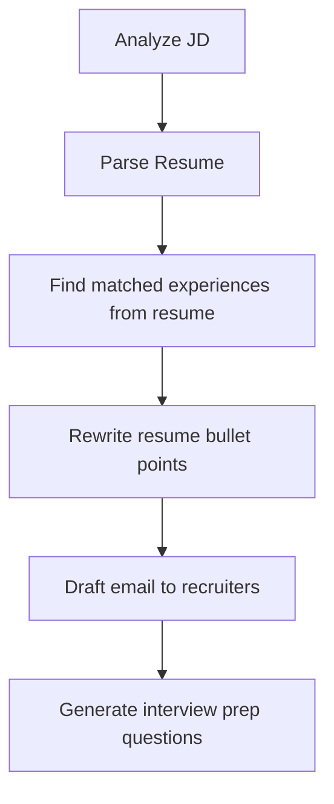

## Agent workflows

```mermaid
flowchart TB
    A["Analyze JD"] --> B["Parse Resume"]
    B --> C["Find matched experiences from resume"]
    C --> D["Rewrite resume bullet points"]
    D --> E["Draft email to recruiters"]
    E --> F["Generate interview prep questions"]
```
